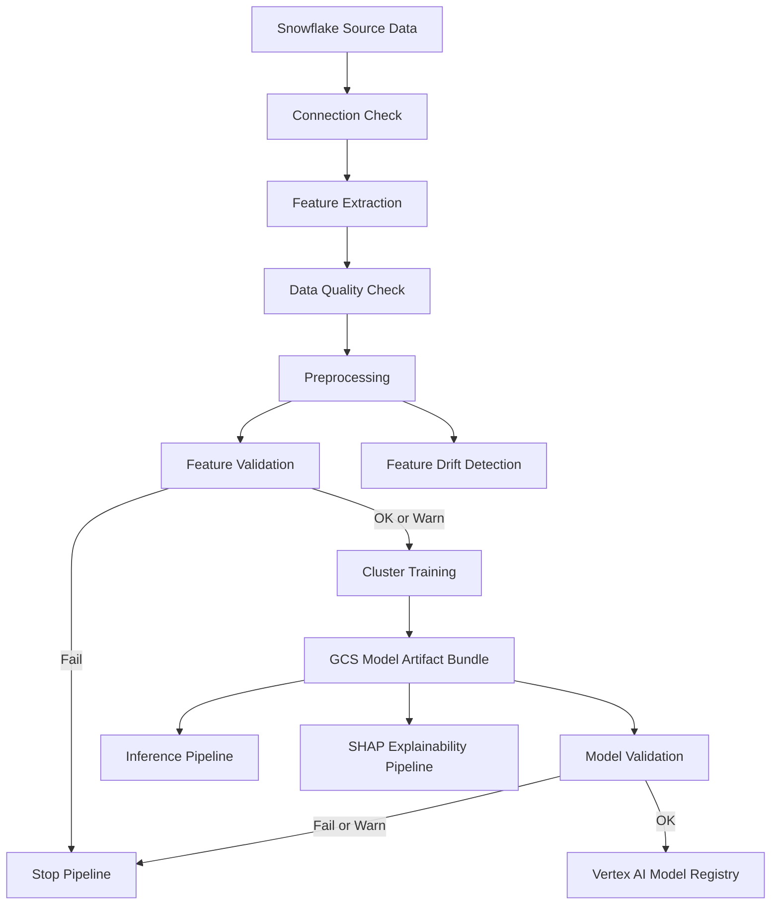

# MLOps Clustering Pipeline

A production-style machine learning pipeline for training, validating, versioning, registering, and consuming segment-level clustering models.

The project integrates **Snowflake** for data processing with **Google Cloud Vertex AI** for pipeline orchestration and model lifecycle management.

The focus of this repository is not only model training. It implements an end-to-end workflow covering data validation, feature validation, model training, model quality gates, versioned artifacts, model registration, inference, explainability, and drift detection.

---

## Architecture and Workflow

The main training pipeline follows this flow:



The pipeline uses validation gates to control downstream execution.

A successful training job does not automatically result in model registration. Feature validation and model validation determine whether the pipeline is allowed to continue.

---

## What This Project Demonstrates

- ML pipeline orchestration with Vertex AI Pipelines
- Snowflake and Snowpark integration
- Data quality and feature validation
- Per-segment clustering with KMeans and MiniBatchKMeans
- Model selection using silhouette scores
- Conditional pipeline execution and quality gates
- Versioned model artifacts in Google Cloud Storage
- Manifest-based artifact discovery
- Vertex AI Model Registry integration
- Cluster inference workflows
- SHAP-based explainability
- Feature and data drift detection

---

## Technology Stack

| Area | Technology |
|---|---|
| Cloud Platform | Google Cloud |
| ML Orchestration | Vertex AI Pipelines |
| Model Registry | Vertex AI Model Registry |
| Data Platform | Snowflake |
| Data Processing | Snowpark |
| Artifact Storage | Google Cloud Storage |
| Machine Learning | scikit-learn |
| Clustering | KMeans / MiniBatchKMeans |
| Explainability | SHAP |
| Secrets | Google Cloud Secret Manager |
| Language | Python |

---

## Training Pipeline

The main pipeline performs the following stages.

### 1. Connection Check

Validates connectivity to Snowflake before data processing begins.

### 2. Feature Extraction

Runs the extraction process and writes the resulting feature data into Snowflake.

### 3. Data Quality Validation

Performs basic checks such as:

- Table existence
- Column availability
- Minimum row count
- Null-rate checks

### 4. Preprocessing

Transforms extracted data into a modeling-ready feature table.

### 5. Feature Validation

Compares the preprocessed features against a configured baseline.

Possible results:

```text
ok
warn
fail
```

If validation fails, model training is skipped.

### 6. Per-Segment Cluster Training

Models are trained independently for configured segments or industries.

The training process:

1. Loads preprocessed data.
2. Selects configured features.
3. Trains clustering candidates.
4. Evaluates different cluster counts.
5. Uses silhouette score for model selection.
6. Writes the selected model artifacts.

---

## Model Artifacts

Each successful training run produces a versioned artifact bundle in Google Cloud Storage.

```text
gs://<bucket>/models/sow-clusters/<RUN_ID>_<TIMESTAMP>/

├── manifest.json
├── score.py
├── segment_CONSUMER.json
├── segment_COMMERCIAL.json
└── segment_<SEGMENT>.json
```

Each artifact bundle represents a specific training run.

### Manifest

The `manifest.json` file acts as the contract between training and downstream pipelines.

It contains metadata such as:

- Run ID
- Training timestamp
- Feature columns
- Available segments
- Training status
- Customer counts
- Selected number of clusters
- Silhouette scores
- References to segment artifacts

Inference and explainability pipelines use the manifest to locate the required artifacts instead of hardcoding filenames.

---

## Model Validation and Registration

After training, the generated model artifacts are validated.

The validation stage evaluates the silhouette scores produced during training.

```text
Train Model
     |
     v
Validate Model
     |
     +----------------+
     |                |
 FAIL / WARN          OK
     |                |
     v                v
    STOP       Register Model
                    |
                    v
          Vertex AI Model Registry
```

Only models that meet the configured validation criteria are registered.

This separates **successful model training** from **model acceptance**.

---

## Inference

Inference workflows consume the versioned model artifact bundle to assign cluster labels.

```text
Input Data
    |
    v
Identify Segment
    |
    v
Load manifest.json
    |
    v
Resolve Segment Artifact
    |
    v
Apply Stored Transformation
    |
    v
Assign Cluster
    |
    v
Write Results
```

The manifest-based approach allows downstream components to discover the correct artifact without depending on hardcoded model filenames.

---

## Explainability

The repository includes a separate SHAP explainability workflow.

The pipeline uses:

- A preprocessed dataset
- A trained model artifact bundle
- Segment-specific clustering information

The workflow loads the model manifest, resolves the required segments, executes the project's explainability logic, and writes the resulting outputs.

Optional artifacts such as plots and JSON files can also be stored in Google Cloud Storage.

---

## Drift Detection

The project includes a separate workflow for monitoring changes in feature distributions.

The drift pipeline compares current data against a reference or baseline dataset and produces results that can be used to identify changes in incoming data.

```text
Reference Data          Current Data
       |                     |
       v                     v
Baseline Statistics --> Feature Comparison
                              |
                              v
                         Drift Result
```

---

## Repository Structure

```text
src/
├── data/
│   ├── connect.py
│   ├── preprocessing.py
│   └── shap_explain.py
│
└── pipeline/
    ├── components/
    │   ├── connection_check_component.py
    │   ├── extract_snowflake_to_snowflake_component.py
    │   ├── data_quality_check_component.py
    │   ├── preprocess_snowflake_component.py
    │   ├── feature_threshold_check_component.py
    │   ├── train_cluster_component.py
    │   ├── model_validation_component.py
    │   ├── register_model_component.py
    │   └── ...
    │
    ├── pipeline_definition_full.py
    ├── pipeline_definition_inference.py
    ├── pipeline_definition_shap.py
    ├── pipeline_definition_drift.py
    │
    ├── run_full_pipeline.py
    ├── run_inference_pipeline.py
    ├── run_shap_pipeline.py
    └── run_drift_pipeline.py
```

---

## Running the Pipelines

Run the main training pipeline:

```bash
python -m src.pipeline.run_full_pipeline
```

Other workflows can be executed independently:

```bash
python -m src.pipeline.run_inference_pipeline
python -m src.pipeline.run_shap_pipeline
python -m src.pipeline.run_drift_pipeline
```

Pipeline configuration includes environment-specific values such as:

- GCP project and region
- Snowflake connection configuration
- Secret Manager references
- Database and schema
- GCS artifact locations
- Run ID and timestamps
- Feature configuration
- Segment configuration
- Training parameters
- Validation thresholds

Sensitive credentials and environment-specific secrets should not be committed to the repository.

---

## Design Decisions

### Validation Before Training

Feature validation occurs before training to prevent invalid or unexpected data from producing model artifacts.

### Validation Before Registration

Training completion does not automatically mean that a model is accepted. A separate validation stage determines whether the generated model artifacts meet the configured quality criteria.

### Versioned Artifacts

Each training run creates a unique artifact bundle using a run ID and timestamp. This allows downstream workflows to reference a specific model version rather than relying on a mutable `latest` location.

### Manifest-Based Artifact Discovery

The manifest provides a contract between training and downstream consumers.

```text
manifest.json
      |
      v
Segment Metadata
      |
      v
Artifact Reference
      |
      v
Load Required Model
```

This reduces coupling between training, inference, and explainability workflows.

---

## Project Scope

This repository demonstrates practical MLOps engineering patterns for managing a machine learning system from data processing through model registration and downstream consumption.

The focus is on building controlled, reproducible ML workflows with validation gates, versioned artifacts, and clearly separated pipeline stages rather than treating machine learning as a standalone training script.
